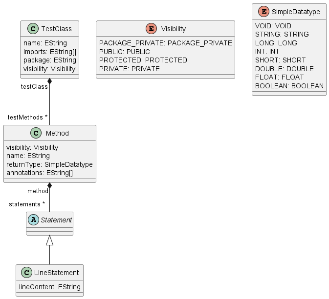

# TDT4250-Group02

## OPEN TO-DOs
* README
	* Describe the models in Model section
	* Extend Usage section by explaining how to run the transitions
* Model-to-Text transition
	* How could we trigger this workflow from java code e.g. inside the TestSuiteConverter class?
	* Why are we generating so many empty lines?

## Description
Our project is about generating java unit tests. This repository contains eclipse plugins which can automatically generate test code for a web API. The test cases are specified as a sequence of REST requests, containing all the necessary information to execute the given HTTP requests, including parameters, headers and expected response codes. Further information on the data structures can be seen in the [Models section](#Models).

## Usage
The test code generation can be triggered in different ways.
1. **A Model-to-Model transition**; starting from a [TestSuite](#testsuite-model) specification file, containing all the use cases in JSON format. This is done by running the TestSuiteConverter java class, located in the transitions/src/modeltomodel package, which performs the transformation. This class runs a whole stack of java classes, together building the java test model. To run the transformation, you need to run the TestSuiteConverter as an acceleo application, using these run configurations  
  
2. **A Model-to-Text transition**; starting from a model of the to be generated java test class, conforming to the [JavaTestModel](#javatestmodel). This transition is done by running the generateJavaCode mtl file, which is located in the transitions/src/model2text package. This transforms the model created with the m2m transition if done with correct run configurations. To run the transformation, you need to run the TestSuiteConverter as an acceleo application, using these run configurations  

### Sirius 
It's possible to edit the Testsuite Model using a graphical interface made with Sirius. To do so run the `no.ntnu.tdt4250.design` as an Eclipse Application and open the `no.ntnu.tdt4250.demo` plugin. Here there is an example of a TestSuite instance as a xmi file, click on the arrow and open the `TestSuitediagram` viewpoint as shown here:

It will open a graphical interface in which it's possible to see every TestCase for the selected TestSuite. In this viewpoint it's possible to:
- show/hide the TestSuite by selecting/deselecting the layer `TestSuite`
- add TestCases by dragging the `TestCase` element from the sidebar to the diagram
- add TestSteps (APIRequests) by dragging the `ApiRequest` element from the sidebar inside a `TestCase`
- edit the attributes of the TestCase by clicking on the element and editing the attributes in the properties view
- edit the attributes of the TestStep by clicking on the element and editing the attributes in the properties view

By double clicking on a TestStep, it's possible to open the `TestStep` viewpoint, which shows the TestStep in a more detailed way. In this viewpoint it's possible to:
- show/hide the Headers and Parameters by selecting/deselecting the layers `Headers` and `Parameters`
- add Headers and Parameters by dragging the `createHeader` and `createParameter` elements from the sidebar to the diagram
- edit the attributes of the Header and Parameter by clicking on the element and editing the attributes in the properties view
- edit the attributes of the TestStep by clicking on the element and editing the attributes in the properties view
- add and edit Assertions. To add an assertion, drag the `createAssertion` element from the sidebar to the TestStep. To edit an assertion, click on it and edit the attributes in the properties view

## Models

#### TestSuite Model

#### JavaTestModel

Validations:
- `TestClass` `name` attribute must be a valid java identifier and the first letter must be capitalized
- `TestClass` `package` name must be a valid java package name 
- `TestClass` `imports` must start with import and end with a semicolon
- `Method` `annotations` must start with @ and be a valid java identifier
- `Method` `name` must be a valid java identifier and the first letter must be lowercase

## Project Context
This repository is the results of the project in the course TDT4250 Advanced Software Design at the Norwegian University of Science and Technology in 2022.

## Authors
Davide Aimar, 
Gaute Brandser, 
Martin Mayr, 
Richard Zahn
